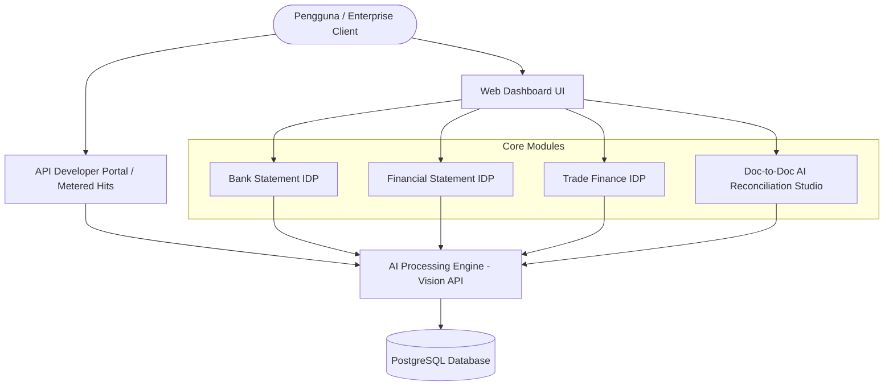

# 🚀 DocIDP (WideIDP) - Application Feature & Architecture Recap

**DocIDP** (WideIDP) adalah platform **Enterprise Intelligent Document Processing (IDP)** & **AI Reconciliation Studio** berbasis Flask, PostgreSQL, dan OpenAI Vision API (`gpt-4o`). Platform ini dirancang untuk mengotomatisasi ekstraksi, klasifikasi, analisis keuangan, serta rekonsiliasi silang antar dokumen keuangan dan perdagangan.

---

## 📌 Ringkasan Fitur Utama (Executive Summary)

---

## 📑 1. Modul Bank Statement (`/bank-statement/`)

Mengolah dan menganalisis rekening koran dari berbagai bank secara otomatis.

### **Kapabilitas**:
- **Single & Bulk Batch Upload**: Mendukung unggah berkas tunggal maupun bulk (banyak dokumen sekaligus di latar belakang).
- **Header Metadata Extraction**: Ekstraksi otomatis Nama Bank, Nomor Rekening, Tipe Akun, Nama Pemilik Rekening, Periode Pernyataan, dan Mata Uang.
- **Tabel Transaksi & Klasifikasi**: Ekstraksi detail transaksi (Tanggal, Deskripsi, Debet/Kredit, Saldo Akhir).
- **Rule Subkategori & Keyword Custom**: Fitur kustomisasi kata kunci untuk kategorisasi otomatis transaksi kas.
- **Apple Single Page View Navigation**: Mode tampilan per halaman (*Single Page View*) dilengkapi navigasi dropdown dan *jump pills* (`Hal 1`, `Hal 2`, dst.) untuk mencegah scrolling vertikal tanpa akhir.

---

## 📊 2. Modul Financial Statement (`/financial-statement/`)

Mengolah laporan keuangan perusahaan (Laporan Posisi Keuangan, Laporan Laba Rugi, dan Laporan Arus Kas).

### **Kapabilitas**:
- **Klasifikasi Otomatis Tipe Laporan**: Membedakan secara otomatis jenis dokumen *Balance Sheet (BS)*, *Income Statement (IS)*, dan *Cash Flow Statement (CS)*.
- **Ekstraksi Multi-Tahun**: Menganalisis dan membandingkan angka keuangan tahun berjalan (*Current Year*) dan tahun sebelumnya (*Last Year*).
- **Metrik Keuangan Utama**: Ekstraksi otomatis Total Aset Lancar, Total Liabilitas, Ekuitas, Revenue, HPP, Gross Profit, EBIT, serta Arus Kas Operasi/Investasi/Pendanaan.
- **Filter Status & Badge Visual**: Penanda status modern (*Finished*, *Processing*, *Error*) dengan ikon berwarna dan format tanpa kata "Hal".

---

## 🤝 3. Modul Trade Finance (`/trade-finance/`)

Mengolah set dokumen perdagangan internasional yang kompleks.

### **Kapabilitas**:
- **Multi-Document Type Set**: Klasifikasi dan pengolahan otomatis berkas *Letter of Credit (LC)*, *Commercial Invoice*, *Bill of Lading (B/L)*, *Draft/Bill of Exchange*, dan *Packing List*.
- **Field Extraction**: Ekstraksi otomatis *Field LC No*, *Beneficiary*, *Drawee*, *Customer*, *Currency*, *Amount*, dan *Tenor*.
- **Mode Manual Supervisor**: Option toggle bagi supervisor untuk peninjauan manual data perdagangan.
- **Smart Form Validation & Fallback**: Penanganan cerdas input nama perusahaan/kategori menu default (`General` & `Trade Finance`) sehingga pengunggahan dapat dilakukan dengan cepat.

---

## 🧪 4. IDP Playground Studio - AI Reconciliation Studio (`/playground/`)

Studio rekonsiliasi silang interaktif berbasis AI Engine yang mendukung 2 mode utama:

### **Kapabilitas**:
- **Dual Mode Switcher**:
  1. **Doc-to-Doc Reconcile**: Rekonsiliasi 2 dokumen fisik (PDF/JPG/PNG) secara langsung (misal: LC/PO vs Commercial Invoice).
  2. **Excel vs Dokumen (Bulk)**: Rekonsiliasi massal tabel data dari berkas Excel/CSV (Master Data) terhadap 1 atau beberapa foto/scan dokumen fisik.
- **Excel Master Data Dropzone & Template Download**:
  - Mengunggah berkas Excel (`.xlsx`, `.xls`) atau `.csv`.
  - Dilengkapi tombol **Unduh Template Excel** (`/v1/excel-to-doc/template`) untuk mempermudah pengguna menyiapkan data awal.
- **Multi-Document Dropzone**: Mendukung pengunggahan beberapa foto/scan dokumen sekaligus untuk dibandingkan dengan baris data Excel.
- **AI Matching & Comparison Matrix**:
  - Membandingkan nilai expected (Excel) vs actual (Dokumen).
  - Skor kemiripan (*similarity score %*), status *MATCH/FUZZY MATCH/MISMATCH*, serta catatan audit (*Audit Notes*).
- **Apple Studio Glassmorphism Aesthetics**: Tampilan UI premium transparan berteknologi modern tanpa tombol AI slop.

---

## 🔑 5. API Developer Portal & Metered Billing (`/developer/`)

Portal pengembang untuk integrasi API B2B berbasis penggunaan (*IDP Per-Hit*).

### **Kapabilitas**:
- **Metered Telemetry Dashboard**:
  - **Kredit Hit Tersedia**: Saldo kuota eksekusi real-time (misal: `4,850 / 5,000 Hits`).
  - **Total Eksekusi API**: Akumulasi penggunaan dokumen.
  - **SLA & Success Rate**: Tingkat keandalan sistem (misal: `99.8%`).
- **Cryptographic API Key Management**:
  - Membuat API Key baru dengan Secret Key (`doc_live_...`) yang ditampilkan *one-time*.
  - Opsi **Revoke** (nonaktifkan) dan **Hapus Permanen** Key dengan konfirmasi dialog.
- **Interactive Quickstart Generator**:
  - Generator snippet kode otomatis untuk rute *Doc-to-Doc*, *Bank Statement*, *Financial Statement*, dan *Trade Finance*.
  - Pilihan bahasa: **cURL**, **Python**, dan **Node.js** dilengkapi tombol *One-Click Copy*.
- **Real-Time Audit Trail Log**: Menampilkan 50 eksekusi API per-hit terakhir lengkap dengan waktu, endpoint, HTTP status code, latency (ms), dan pengurangan kuota hit (`-1 Hit`).

---

## 👤 6. Administrator Console (`/administrator/`)

Portal administrasi untuk mengelola tenant/perusahaan dan pengguna.

### **Kapabilitas**:
- **Manajemen Perusahaan & Limit Usage**: Menetapkan batas kuota (*limit*) dan memantau pemakaian (*usage*) per perusahaan.
- **Role-Based Access Control (RBAC)**: Pengaturan peran pengguna (*Analyst*, *Admin*).
- **Detail Perusahaan**: Menampilkan daftar rekaman dokumen dan analisis pemakaian per tenant.

---

## 🎨 Standar Desain UI/UX (Apple Studio Design System)

1. **Clean White & Glassmorphism Aesthetics**: Penggunaan palet warna HSL modern, backdrop filter blur, border tipis halus, dan bayangan yang elegan.
2. **Pop-up & Notification Non-Blocking**:
   - Seluruh notifikasi menggunakan **Toast Apple** (`window.showToast`) berwarna lembut.
   - Konfirmasi aksi sensitif menggunakan **Modal Konfirmasi Apple** (`window.showConfirmModal`).
   - Tidak ada lagi `alert()` atau `confirm()` bawaan browser yang mengganggu.
3. **DataTables Safe Re-initialization**: Penanganan DataTables v2 dengan opsi `destroy: true` dan fungsi *debouncing* untuk mencegah bentrokan/warning re-initialization saat unggah async.
4. **Scrubbed AI Slop / OpenAI Branding**: Seluruh teks antarmuka menggunakan istilah umum seperti *"AI Engine"* atau *"sistem"* tanpa menyebut merek pihak ketiga di sisi pengguna.

---

## ⚙️ Spesifikasi Arsitektur Teknis

- **Backend Framework**: Python Flask (Gunicorn/WSGI ready)
- **Database**: PostgreSQL (SQLAlchemy ORM)
- **Authentication**: Flask-Login, Flask-JWT-Extended, Flask-Bcrypt
- **Image & PDF Processing**: `pdf2image`, `poppler-utils`, `Pillow`
- **AI Processing**: OpenAI API (`gpt-4o` Vision API)
- **Frontend Stack**: HTML5, Vanilla JavaScript (ES6+), Bootstrap 5, FontAwesome 6, DataTables v2
